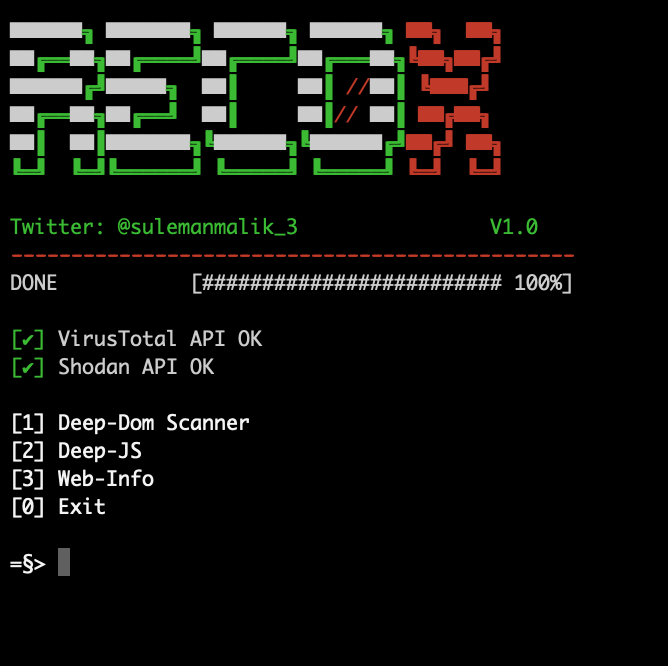

# Recox v2.0
The script aims to help in classifying vulnerabilities in web applications. The methodology RecoX is arising can spot weaknesses other than OWASP top ten. The script presents information against the target system. It gathers the information recursively over each subdomain, and IP addr for a sophisticated attack. RecoX automates several functions and saves a significant amount of time that requires throughout a manual penetration test.
<br>For more detail please read this  <a href="https://drive.google.com/file/d/1oOshL5Fc3WiSy3SQFv26UE3YKo5N211i/view?usp=sharing" >document</a>.

# Usage
```
git clone https://github.com/samhaxr/recox
chmod +x recox.sh
./recox.sh
```
Paste the below command to run the tool from anywhere in the terminal.
```
mv recox.sh /usr/local/bin/recox
```

The deep scanner comprises many check-ups including subdomain takeover, A record, passive scan, active scan, CORS misconfiguration, zone transfer test, and web content discovery.


# Update
New version v2.0 includes bug fixes and CVE Reporting.

# Youtube Tutorial
[](https://youtu.be/rV5mCUWc1kk)

# Credit

<a href="https://github.com/RUB-NDS" >Ruhr University Bochum - Chair for Network and Data Security
</a>, 
<a href="https://github.com/deibit" >David García</a>, <a href="https://github.com/jobertabma" >Jobert Abma</a>, <a href="https://github.com/antichown" >antichown</a>
